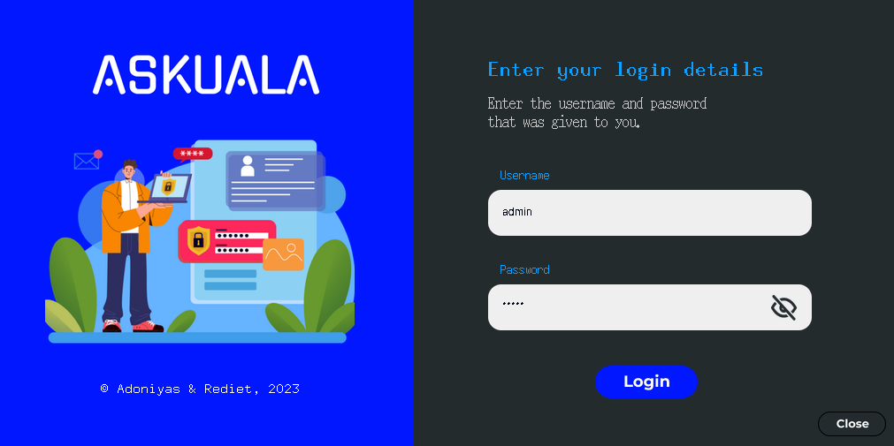
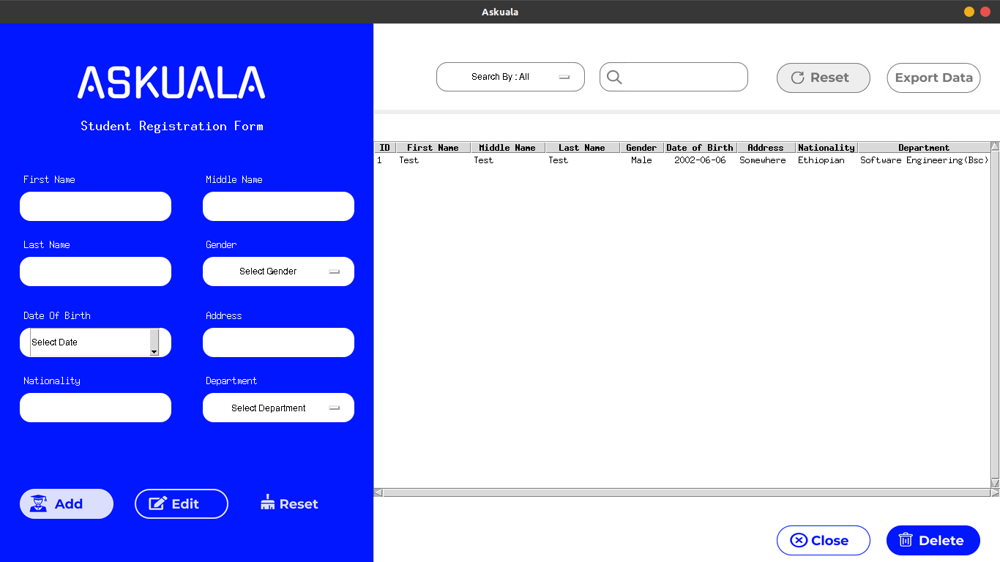

## ASKUALA

A simple student registration system made with python and tkinter.

## Screenshots

## Features

with this program you can:

- add student
- delete student
- edit student
- search student
- sort student data
- save student data to file

## How to use

1. install python 3.7 or newer
2. install tkinter
3. run the program with `python main.py`
4. admin username: admin
5. admin password: 12345

## Made by

[Adoniyas Getachew](https://github.com/Adoniyas7/)

## License

Distributed under the MIT License. See [LICENSE](LICENSE) for more information.
